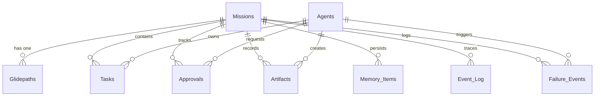

# Supr. — Ultimate Reference & Conversational Guide

This document is a comprehensive, self-contained reference manual detailing what **Supr.** is, its technical architecture, design system, core capabilities, database schema, server actions, security controls, and infrastructure setup. 

You can upload this file directly to any LLM application (like Google Gemini) to converse with it about the code, request adjustments, debug execution steps, or plan future extensions.

---

## 1. Core Philosophy: What is Supr.?
**Supr.** is an enterprise-grade AI Agent Supervisor and Collaboration Workspace. Unlike typical autonomous agent tools that run in isolated terminals, Supr sits as a centralized orchestration layer that tracks, guides, and audits both **Permanent** and **Temporary** agents as they execute complex workflows.

### High-Level Orchestration Workflow
1. **Mission Formulation:** A manager defines a goal (e.g., *"Audit security dependencies"*).
2. **Glidepath Generation:** Supr breaks the mission into concrete phases and tasks.
3. **Agent Assignment:** Specialized agents are spawned or assigned from the roster to own specific tasks.
4. **Governance Triage:** If a task requires elevated access (like running terminal scripts or writing to a repository), it goes to the **Approvals Gate** for manual review or autonomy checks.
5. **Execution & Deliverables:** Agents produce markdown documents, JSON configs, or code scripts. These are stored in the database as **Artifacts** and saved in local sandboxes.
6. **Quality Assurance:** The QA Agent validates outcomes before updating the readiness score.

---

## 2. Technical Stack & File Directory Map

Supr is built on a modern, unified JavaScript and database framework designed to run locally on Windows/macOS or scale in production container instances:

* **Framework:** Next.js (App Router, Server Actions, Standalone Builds).
* **Database:** SQLite (`better-sqlite3` with Write-Ahead Logging `WAL` enabled).
* **AI Orchestration:** Google GenAI SDK (`@google/genai` models like `gemini-2.5-flash` or `gemini-2.5-pro` for reasoning/chat, and `imagen-3.0-generate-002` for image generation).
* **Styling:** Tailwind CSS with dynamic custom utility overrides.
* **Sandbox Runner:** Node.js child process executors mapping to local isolated directories.

### File Structure Map
```
Supr/
├── app/                        # Next.js App Router (Pages, CSS, layout)
│   ├── actions.ts              # Database mutations, LLM chat, and file execution Actions
│   ├── globals.css             # Main styling, 7 structural themes, and 15 color palettes
│   ├── layout.tsx              # Root wrapper with non-flicker theme loader
│   ├── page.tsx                # Dashboard and project rollup summary
│   ├── library/                # Universal Artifacts Library Dashboard
│   ├── login/                  # Neo-Brutalist Authentication gate screen
│   ├── settings/               # System and integrations setup panel
│   └── supr-chat/              # Rapid-fire chat page with Sandbox Canvas Drawer
├── components/                 # Reusable React components (neo-brutalist styling)
│   ├── Sidebar.tsx             # Primary navigation sidebar
│   ├── TopNav.tsx              # Dynamic header with theme & mobile controls
│   ├── SteerableCanvas.tsx     # Project execution board
│   └── AgentVisionLab.tsx      # Terminal views and logs
├── lib/                        # Backend utilities
│   ├── database/
│   │   ├── init.ts             # SQLite schema initializer and default seeding
│   │   └── migrate.ts          # Database migration tools
│   ├── db.ts                   # Core database CRUD interfaces
│   └── providers/              # LLM client setup
├── supr_workspaces/            # Physical folder for sandboxed script executions
├── .agents/                    # Persistent Agent Identity Profiles (.md files)
├── supr_local.db               # SQLite database file
├── Dockerfile                  # Production build recipe
└── docker-compose.yml          # Container configuration for VPS
```

---

## 3. Database Schema

Supr uses SQLite (`supr_local.db`) with foreign key constraints enabled. Below is the relational mapping of the 13 tables:



### Table Definitions

#### 1. `Missions`
Stores the active and completed project intents.
* `id` (TEXT, PK): Unique identifier.
* `title` (TEXT): Name of the mission.
* `goal` (TEXT): Core objective description.
* `workflow_type` (TEXT): Routing pattern.
* `autonomy_mode` (TEXT): Autonomous vs. Guided approval flow.
* `status` (TEXT): Active, Completed, Paused, or Failed.
* `current_phase_id` (TEXT): Current execution cursor.
* `created_at` / `updated_at` (DATETIME).

#### 2. `Glidepaths`
Holds the operational checklists generated during mission startup.
* `id` (TEXT, PK)
* `mission_id` (TEXT, FK): Link to Mission.
* `phases` (TEXT): JSON array of phases.
* `tasks` (TEXT): JSON array of roadmap tasks.
* `approval_gates` (TEXT): JSON array of checklist items requiring user signoff.
* `progress` (REAL): Float from `0` to `100`.
* `readiness_score` (REAL): QA metrics score from `0` to `1`.

#### 3. `Agents`
Registers the active roster of AI workers.
* `id` (TEXT, PK)
* `name` (TEXT): Agent name.
* `role` (TEXT): Role description.
* `type` (TEXT): `permanent` or `temporary`.
* `permission_tier` (TEXT): `Observe`, `Draft`, `Edit`, or `Execute`.
* `tools` (TEXT): JSON array of active capability tool strings.
* `status` (TEXT): Idle, Working, or Suspended.

#### 4. `Tasks`
Individual tasks that agents execute during a phase.
* `id` (TEXT, PK)
* `mission_id` (TEXT, FK)
* `title` (TEXT): Task name.
* `status` (TEXT): `pending`, `in_progress`, `completed`, or `failed`.
* `owner_agent_id` (TEXT, FK): Owner Agent.
* `required_permission` (TEXT): Autonomy clearance required.

#### 5. `Approvals`
Governance registry tracking elevated actions that require permissions.
* `id` (TEXT, PK)
* `mission_id` (TEXT, FK)
* `task_id` (TEXT, FK)
* `requesting_agent_id` (TEXT, FK)
* `action` (TEXT): Elevated command (e.g., shell command execution).
* `status` (TEXT): `pending`, `approved`, `rejected`, or `revised`.

#### 6. `Artifacts`
Permanent outputs generated by missions (documents, scripts, audits).
* `id` (TEXT, PK)
* `mission_id` (TEXT, FK)
* `type` (TEXT): `markdown`, `code`, `json`, `text`.
* `title` (TEXT): Filename (e.g., `Strategic_Briefing.md`).
* `content` (TEXT): Raw contents of the artifact.
* `created_at` (DATETIME).

#### 7. `Supr_Chat_Messages`
Persistent message logs specifically for the **Supr-Chat** interface.
* `id` (TEXT, PK)
* `sender` (TEXT): `user` or `supr`.
* `content` (TEXT): Plain text or markdown message.
* `file_name` (TEXT, NULL): Name of uploaded attachment.
* `file_type` (TEXT, NULL): MIME type.
* `file_content` (TEXT, NULL): Base64 encoded or raw text contents of the attachment.
* `created_at` (DATETIME).

#### 8. `Settings`
Key-value repository storing appearance configurations and credentials.
* `key` (TEXT, PK): Setting name.
* `value` (TEXT): Config value.

---

## 4. Key Architectural Features

### A. Supr-Chat (`/supr-chat`)
A premium, rapid-fire workspace intended for immediate interactions with the supervisor (e.g., retrieving files, looking up metrics, doing mock run tests).
* **Multimodal Upload Engine:** Users can click the paperclip attachment icon to upload files of any format (images, PDF, code files, logs, configs). The client-side reads text files directly, and translates binary files to Base64 data URLs. This package is sent to the server action, stored in the DB, and passed directly inside the Gemini API request context.
* **Inline Imagen 3.0 Generation:** If the chat input triggers keywords (e.g., *"generate image"*), Supr calls Google GenAI's `imagen-3.0-generate-002` model using the active key, converting the resulting image bytes into a base64 string, saving it as `generated_image.png` in the database, and displaying it natively inside the chat bubble. If the API key is not configured, it fails gracefully by compiling a custom SVG layout with the prompt embedded.
* **Quiet Cog Setup:** Configuration parameters (temperature, active models, autonomy gates) are hidden under a subtle gear icon in the chat header, ensuring the primary workspace remains clean and free of unnecessary clutter.

### B. Interactive Canvas Drawer
A collapsible drawer next to Supr-Chat that provides a visual playground to monitor and execute files in real-time. It contains three distinct panels:
1. **Sandbox Files:** Lists all files physically located inside the `./supr_workspaces/` folder (filename, byte size, updated timestamp). Users can view, create new files, rename, download, or delete them directly.
2. **Editor Preview:** Selecting a file opens it in a full-height interactive textarea editor. Users can write code or update configurations and hit "Save Changes" to update the file on the physical filesystem.
3. **Terminal Output:** Clicking "Execute Code" runs Python (`.py`) or Node.js (`.js`) files in a native subshell (`child_process`). Standard outputs and standard errors are caught and printed live on screen, complete with traceback details.

### C. Universal Artifact Library (`/library`)
A unified search index of all deliverables produced across every mission:
* Scrapes the `Artifacts` database table.
* Provides real-time text filtering against file names and contents.
* Includes file-type tags (`markdown`, `code`, `json`) to isolate files quickly.
* Provides a direct download icon that retrieves the raw content as a file download.

### D. Dual-Behavior Integration Bridge (Real vs. Simulated)
Integrations reside securely on the Settings page under four key fields: **Composio Key**, **GitHub PAT**, **Slack Webhook URL**, and **Gmail App Password**.
* **Simulated Telemetry (Default):** If the input fields are left blank, Supr runs a sandbox emulator. When the user requests a task (e.g., *"read my email"*, *"post a Slack alert"*), the backend prints a detailed CLI trace detailing the request type, API path, mock response payload, and simulated headers.
* **Live Execution (Active Keys):** As soon as credentials are saved in SQLite, Supr transitions to live execution:
  * **Slack:** Triggers a `POST` request to the custom incoming webhook.
  * **GitHub:** Uses the PAT to authenticate and write issues or commit files.
  * **Gmail:** Executes action bridges using Composio or nodemailer parameters.

---

## 5. UI Themes & Zero-Flicker Customizer

Supr includes a comprehensive design customizer in `/settings` allowing users to swap between **7 Layout Themes** and **15 3-Tone Color Palettes**.

### The 7 Transforming Themes
1. **Classic Neo-Brutalist (Default):** Flat background fills, thick black borders (`4px`), blocky corners, and hard offset shadows. Monospace headers combined with Inter UI.
2. **OpenClaw Terminal:** Retro retro-futuristic dark mode. Mimics a physical command-line monitor: CRT glass curvatures, phosphor glow shadows, scanline overlays, monospace code fonts, and terminal headers.
3. **Hermes Cybernetic:** Clean tech interface with very thin borders, glowing cyan neon borders, and dark blueprints.
4. **Google Neural:** Modern consumer design. 20px organic border radii, soft frosted glass panels (`backdrop-filter: blur`), subtle gradients, and pastel radial background lights.
5. **Phosphor CRT:** Dark monochrome green command center with active screen flickering animations.
6. **Neon Cyberpunk:** Hot pink borders, high-intensity neon purple shadows, and angular accents on a dark slate canvas.
7. **Minimalist Clean:** White and gray borders, light-mode panels, and extremely soft gray drop-shadows.

### Zero-Flicker Script (FOUC Prevention)
When Next.js loads, React hydration takes a few hundred milliseconds, which would normally cause the page to flash the default neo-brutalist styling (Flash of Unstyled Content) before applying the user's custom settings. 
To prevent this, the root layout (`app/layout.tsx`) injects a blocking script directly at the top of the HTML `<head>`:

```typescript
// app/layout.tsx
<head>
  <script
    dangerouslySetInnerHTML={{
      __html: `
        (function() {
          const theme = localStorage.getItem('supr_theme') || 'neobrutalist';
          const palette = localStorage.getItem('supr_palette') || 'classic';
          document.documentElement.className = 'theme-' + theme + ' palette-' + palette;
        })()
      `
    }}
  />
</head>
```
This applies the custom CSS variables to the document root immediately on page load, prior to rendering any elements.

---

## 6. Under the Hood: Key Server Actions (`app/actions.ts`)

Server actions run entirely on the server node, shielding system keys and executing database mutations. Key actions include:

### Send Chat Message & Router
Evaluates user inputs, handles files, detects intents, and updates the database:
```typescript
export async function sendChatMessageAction(
  content: string, 
  file?: { name: string; type: string; content: string }
) {
  // 1. Persist User message with optional file attachment
  db.prepare(`INSERT INTO Supr_Chat_Messages ...`).run(...);

  // 2. Fetch recent chat history to pass as context
  const history = db.prepare(`SELECT * FROM Supr_Chat_Messages LIMIT 20`).all();

  // 3. Evaluate integrations and key states
  const settings = await fetchSettingsAction();
  
  let responseText = '';
  let logs: string[] = [];

  // 4. Route task based on text heuristics
  if (isImageRequest) {
    const base64Bytes = await generateImagenImageAction(prompt);
    // Persist and return image message
  } else if (isSlackRequest) {
    if (settings.integrations_slack) {
      // POST to Webhook
    } else {
      // Return telemetry logs and mock simulation
    }
  } else {
    // Normal LLM response using GoogleGenAI SDK
    responseText = await googleGenAiClient.generateContent(...);
  }

  // 5. Save Supr response to database and return
}
```

### Sandbox Code Executor
Executes JavaScript or Python files locally:
```typescript
export async function executeCodeAction(filename: string, language: string) {
  const filePath = getWorkspacePath(filename); // Resolves safe path inside supr_workspaces/
  
  let cmd = '';
  if (filename.endsWith('.py') || language === 'python') {
    cmd = `python "${filePath}"`;
  } else if (filename.endsWith('.js') || language === 'javascript') {
    cmd = `node "${filePath}"`;
  } else {
    return { success: false, error: 'Unsupported file type.' };
  }

  try {
    const { stdout, stderr } = await execAsync(cmd, { cwd: './supr_workspaces' });
    return { success: true, stdout, stderr };
  } catch (error: any) {
    return { success: false, error: error.message, stdout: error.stdout, stderr: error.stderr };
  }
}
```

---

## 7. Security Controls

1. **Authentication Gate Middleware:** If the `APP_PASSWORD` environment variable is set, the global `middleware.ts` intercepts all App Router requests. It verifies the presence of the `supr_auth_token` cookie. Unauthenticated traffic is seamlessly redirected to the `/login` route.
2. **SSRF Scraper Proxy Security:** To allow research scrapers to crawl websites without CORS blocks, `/api/proxy` forwards request content. To prevent SSRF (Server-Side Request Forgery) attacks targeting local systems (like the GCP metadata server or local router keys):
   * Requests targeting loopbacks or local IPs are rejected.
   * A DNS lookup resolves the domain name, checking the IP against all RFC 1918 subnets (`127.0.0.0/8`, `10.0.0.0/8`, `172.16.0.0/12`, `192.168.0.0/16`, `169.254.0.0/16`). If a matches is found, the connection is instantly closed.
3. **Workspace Sanitization:** All file reads/writes in `/supr-chat` are passed through `path.basename(filename)`. This prevents directory traversal attacks (e.g., trying to write to `../../etc/passwd` or `..\..\Windows\System32`).

---

## 8. Deployment & Setup Guide

### Local Development (Windows)

#### 1. Setup Environment
Create a `.env.local` file:
```env
# Google Gemini API Access (Required)
GEMINI_API_KEY=AIzaSyYourGeminiApiKeyHere

# Access authentication (Optional)
# APP_PASSWORD=your_secure_password
```

#### 2. Run App
```powershell
# Install Node dependencies
npm install

# Run the Next.js development server
npm run dev
```
Open `http://localhost:3001` to interact with Supr.

#### 3. Tunneling Public HTTPS (Cloudflare Tunnel)
If you want to access Supr on a mobile device or showcase it to team members, run the pre-bundled Cloudflare binary directly:
```powershell
.\cloudflared.exe tunnel --url http://localhost:3001
```
This generates a temporary public HTTPS link (e.g., `https://example-words.trycloudflare.com`) that routes directly to your local instance.

---

### Production Self-Hosting (VPS via Docker Compose)

SQLite performs at its peak on a VPS where it can lock the filesystem natively:
1. Clone the project onto the server.
2. Create your `.env` file with `GEMINI_API_KEY` and `APP_PASSWORD`.
3. Launch the container stack:
   ```bash
   docker compose up -d --build
   ```
4. Put a reverse proxy like Caddy in front of the service to manage SSL:
   ```caddy
   yourdomain.com {
       reverse_proxy localhost:3001
   }
   ```

---

### Production Serverless Deployment (Google Cloud Run)

To run containerized without managing virtual machines, use GCP Cloud Run Gen2. Because Cloud Run instances are stateless and recycle periodically, we mount a **Google Cloud Storage (GCS)** bucket to the container using **GCS FUSE**:

1. **Create Bucket:**
   ```bash
   gcloud storage buckets create gs://YOUR_PROJECT_ID-supr-state --location=us-central1
   ```
2. **Grant Permissions:** Grant the Compute Service Account permissions to manage GCS bucket objects (`roles/storage.objectAdmin`).
3. **Launch Deploy Script:** Run the deploy helper which mounts the bucket path to `/app/.agents` inside the container:
   ```bash
   ./deploy.sh
   ```
This maps the active SQLite DB and agent profile cards directly onto Cloud Storage, securing persistence across container lifecycles.
