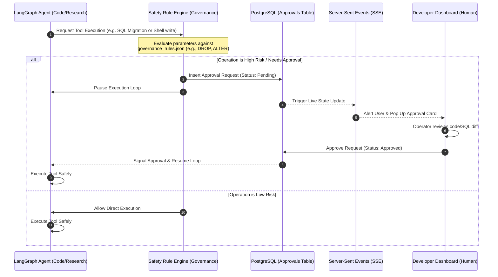

# Supr System Architecture

This document outlines the system architecture and data flow of **Supr**, the secure coding governance orchestrator. 

---

## 🏗️ System Topology

The diagram below illustrates how components interact, from the client's browser to Google Cloud services and Vertex AI:

```mermaid
graph TB
    subgraph Client ["Client Browser"]
        UI["React SPA Dashboard (Next.js App Router)"]
        SSE["Server-Sent Events Listener (Live Updates)"]
    end

    subgraph GCP ["Google Cloud Platform (GCP)"]
        subgraph CloudRun ["Cloud Run (supr-agent Web & Worker)"]
            NextJS["Next.js Server Actions & API Routes"]
            Runtime["LangGraph Execution Loop"]
            Telemetry["Telemetry & Log Forwarder"]
        end

        subgraph DbLayer ["Storage & Secrets"]
            PG[("Cloud SQL (PostgreSQL 15)")]
            SM["Secret Manager (Env & API Keys)"]
        end

        subgraph CloudTasks ["Task Queue"]
            CT["Cloud Tasks (Asynchronous Heartbeats)"]
        end

        subgraph VertexAI ["Google Vertex AI"]
            Gemini["Gemini 1.5 Pro & Flash Models"]
            Embeddings["text-embedding-004 Model"]
        end
    end

    subgraph External ["External Integrations"]
        Github["GitHub Repo Sandbox (Alpha/Beta targets)"]
        MCP["GitHub MCP Server (Workspace File Access)"]
    end

    %% Client Interactions
    UI -->|HTTPS Requests / Actions| NextJS
    NextJS -->|SSE Streams| SSE

    %% Database & Secret Access
    NextJS -->|Unix Socket / Auth Proxy| PG
    NextJS -->|IAM-backed Access| SM
    Runtime -->|Read/Write Session State| PG

    %% Asynchronous Execution
    NextJS -->|Enqueue Jobs| CT
    CT -->|HTTP Webhook Trigger| NextJS

    %% AI Orchestration
    Runtime -->|Google GenAI SDK (Application Default Credentials)| VertexAI
    Gemini -->|Agent Task Reasoning| Runtime

    %% Code Execution & Tooling
    Runtime -->|Execute Shell/Git Commands| MCP
    MCP -->|Read/Write/Commit| Github
```

---

## 🔄 Core Execution & Governance Flow

This diagram shows how a tool execution is checked against security policies and paused for human approval:



---

## 🔒 Security & Data Isolation Architecture

> [!IMPORTANT]
> **Zero-Leak Credentials**: Secret API keys (like GitHub access tokens or custom OpenAI keys) are stored securely in **Google Secret Manager** and masked automatically (`type="password"`) on the UI.
> 
> **IAM-backed AI Platform Access**: The application does not require a hardcoded `GEMINI_API_KEY` in production. Instead, the Cloud Run container utilizes its built-in service account with the **Vertex AI User** (`roles/aiplatform.user`) role to make secure, authenticated requests directly to Google Cloud models.
> 
> **Unix Socket Database Security**: PostgreSQL is protected from public internet exposures by accepting only secure connections routed through mounted Unix sockets `/cloudsql/...` connected directly to the database instance.
